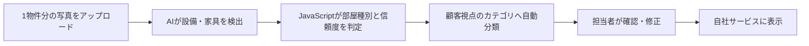

# 企画書

| 項目 | 内容 |
| --- | --- |
| プロジェクト名 | AI物件写真分類サービス |
| 作成日 | 2026/09/14 |
| 作成者 | 渡邉極 |
| 版数 | v0.4 |
| 関連資料 | [概要書](overview.md) |

## 1. 背景・目的

- 不動産会社が撮影する物件写真は撮影順のまま保管・掲載されることが多く、顧客が浴室、キッチン、玄関などの気になる場所の写真を探しにくい。
- 写真を整理する担当者にも、写真の選別・分類・ファイル名変更といった作業負荷が生じる。
- 物件写真をAIで分析し、顧客が確認したい項目ごとに自動分類して見やすく提示することで、物件比較と内見判断を支援する。

## 2. 市場・競合分析

| 項目 | 内容 |
| --- | --- |
| ターゲット市場 | 賃貸・売買仲介会社、物件管理会社、不動産ポータル・物件検索サービスを提供する事業者 |
| 提供形態 | 不動産事業者が自社の物件登録・物件検索サービスへ組み込んで利用するBtoBサービス |
| 主な利用者 | 物件写真を撮影・登録する担当者、および各事業者のサービスで物件を探す顧客 |
| 既存の代替手段 | 撮影担当者または入稿担当者による手動フォルダ分類、物件詳細画面での撮影順表示 |
| 差別化ポイント | YOLOによる設備・家具の検出結果をJavaScriptで分類し、顧客視点のカテゴリへ写真を自動整理する。人による修正を前提とし、誤分類を掲載前に修正できる。 |
| 市場規模 | 未調査。企画承認前に対象地域・事業者規模を定めて調査する。 |

## 3. サービス概要

- 担当者が1物件分の写真をまとめてアップロードすると、YOLOが画像内の設備・家具を検出する。
- JavaScriptの分類処理が検出物と信頼度を基に写真のカテゴリを判定し、顧客が確認したい項目ごとの仮想フォルダに自動配置する。
- 担当者が分類結果を確認・修正した後、自社の物件検索・物件詳細サービスに表示する。

### 3.1 顧客向け分類カテゴリ

| 表示カテゴリ | 主な検出根拠 | 顧客が確認すること |
| --- | --- | --- |
| 浴室 | バスタブ、シャワー、浴室内の設備 | 入浴のしやすさ、浴室の広さ・清潔感 |
| トイレ | 便器、手洗い器、収納 | トイレの設備・清潔感 |
| リビング | ソファ、テーブル、テレビ、窓 | 室内の広さ、家具配置、採光 |
| 玄関 | 玄関扉、下足入れ、廊下 | 出入りのしやすさ、収納量 |
| キッチン | シンク、コンロ、冷蔵庫、収納 | 調理のしやすさ、設備・収納 |
| 洗面所 | 洗面台、洗濯機置場、脱衣所 | 洗面・洗濯のしやすさ、収納 |
| バルコニー | 手すり、物干し竿、屋外床、窓からの眺望 | 日当たり、洗濯物を干す場所、眺望 |

### 3.2 処理フロー

## 4. ターゲットユーザー

| ペルソナ | 課題 | 期待効果 |
| --- | --- | --- |
| 仲介会社の撮影・入稿担当者 | 多数の写真を物件ごと・場所ごとに整理する作業に時間がかかる | 自動分類後の確認・修正だけで掲載準備ができる |
| 物件管理会社の担当者 | 原状確認・募集準備の写真が混在し、必要な写真を探しにくい | 用途ごとに写真を整理し、確認漏れを減らせる |
| 物件を探す顧客 | 見たい場所の写真を撮影順の一覧から探す必要がある | 気になる項目を選び、必要な写真へすぐ到達できる |

## 5. ビジネスモデル（概要）

- 不動産事業者向けに、自社サービスへの組み込みを前提とした月額サブスクリプションとして提供する。
- 料金は利用量と連携方式に応じたNormal・Proの2プランとする。
- プロトタイプでは課金機能を実装せず、分類結果の表示と基本動作の確認を完了条件とする。完成後に自社で運用実験を行い、検証結果を基に導入を進める。

### 5.1 プラン・利用条件

| 項目 | Normal | Pro |
| --- | --- | --- |
| 月額料金 | 10,000円（税別） | 50,000円（税別） |
| 想定顧客 | 小規模の賃貸・売買仲介会社 | 複数店舗の仲介会社、物件管理会社、ポータル運営事業者 |
| 月間写真処理数 | 3,000枚まで | 20,000枚まで |
| 1回のアップロード上限 | 50枚 | 100枚 |
| 一括アップロード | 対象外 | 200枚まで |
| 元画像の保存期間 | 処理完了後7日 | 処理完了後30日 |
| 分類済み画像・結果の保存期間 | 30日 | 90日 |

> 月間写真処理数はアップロードした写真の処理回数で計測する。元画像を期限後に自動削除し、本サービスを長期保管庫として扱わないことで、ストレージ費用と個人情報管理の負荷を抑える。

### 5.2 採算の前提

以下は、YOLO推論基盤を複数契約社で共有し、短期保存で運用する場合の1契約社あたり月額概算である。個別開発費は含まない。

| 項目 | Normal | Pro |
| --- | ---: | ---: |
| 月額売上 | 10,000円 | 50,000円 |
| 変動費合計 | 1,900〜3,450円 | 9,000〜17,300円 |
| 粗利 | 6,550〜8,100円 | 32,700〜41,000円 |
| 粗利率 | 約66〜81% | 約65〜82% |

固定費を含む営業利益率は契約社数と利用状況により変動する。固定費を月150,000円、契約構成をNormal 20社・Pro 5社、変動費をNormal 3,000円・Pro 13,000円とした場合、月間売上450,000円、営業利益175,000円、営業利益率は約39%となる。

## 6. スコープ（概要）

### 対象（1.5日で構築するプロトタイプ）

- JPG・PNG形式の物件写真を複数枚アップロードする機能
- YOLOを用いた設備・家具の検出
- YOLOの検出結果と信頼度を入力とするJavaScriptの分類処理
- 「浴室」「トイレ」「リビング」「玄関」「キッチン」「洗面所」「バルコニー」の7カテゴリ、および「未分類」への自動分類
- 分類結果の一覧表示と担当者による手動修正
- 分類結果の画面表示

### 対象外（将来検討）

- 物件管理システム、不動産ポータルサイトとの自動連携
- 独自の物件写真データによるモデル追加学習
- 物件説明文・キャッチコピーの自動生成
- 顧客行動に基づく写真の最適な表示順の自動決定
- 課金、契約、ユーザー・権限管理

## 7. 概算スケジュール

| フェーズ | 期間 | 主な内容 |
| --- | --- | --- |
| 企画確定 | 0.5日 | 対象カテゴリ、評価用写真、利用シナリオの合意 |
| プロトタイプ開発 | 0.5日 | 写真アップロード、AI推定、カテゴリ別表示、手動修正 |
| 確認・検証 | 0.5日 | 分類結果の確認、評価用写真での分類確認 |
| 自社運用実験 | プロトタイプ完了後 | 自社の物件写真で分類精度、処理時間、運用負荷を測定し、次段階の導入判断に用いる |
| 外部導入 | 自社運用実験後 | 検証結果を基に対象事業者への導入を進める |

## 8. 概算予算

| 項目 | 金額目安 |
| --- | --- |
| プロトタイプ開発費 | 未算定。開発担当の工数単価に基づき算出する。 |
| AIモデル利用費 | プロトタイプはオープンソースモデルを前提とし、商用利用条件を事前に確認する。 |
| インフラ費 | ローカル実行または検証用環境を前提とするため未算定。 |
| 保守・運用費 | 本番運用の要件確定後に算定する。 |

## 9. リスク（概要）

| リスク | 影響度 | 対応方針 |
| --- | --- | --- |
| 部屋種別の誤分類 | 中 | 自動確定せず担当者が確認・修正できる画面を設ける。低信頼度の写真は未分類へ送る。 |
| 既存モデルでは必要な設備を検出できない | 中 | プロトタイプは検出しやすいカテゴリに絞り、評価結果に応じて追加学習を検討する。 |
| 大量処理・長期保存による運用費の増加 | 高 | プラン別の月間処理上限と保存期間を設け、上限超過分は追加料金とする。元画像は期限後に自動削除する。 |
| 写真に個人情報・私物が含まれる | 高 | 評価データを適切に管理し、本番データの利用条件・保存期間・アクセス権限を定義する。 |
| AIモデルのライセンスが利用形態に適合しない | 高 | 導入前にモデルおよび関連ライブラリの商用利用条件を確認する。 |
| 顧客が分類名称を理解しにくい | 中 | 実際の物件探しの利用者にカテゴリ名と導線を評価してもらい、用語を改善する。 |

## 10. 成功指標（プロトタイプ）

| 指標 | 評価方法 |
| --- | --- |
| 写真整理時間 | 手動整理と比較し、1物件あたりの分類・確認完了時間を測定する。 |
| 修正率 | AI分類後に担当者がカテゴリを変更した写真の割合を測定する。 |
| 未分類率 | 判定できず未分類になった写真の割合を測定する。 |
| 顧客の到達性 | 指定した写真カテゴリを顧客が短時間で見つけられるかを操作テストで確認する。 |

## 11. 承認

| 役割 | 氏名 | 承認日 |
| --- | --- | --- |
| 事業責任者 | 未定 | 未定 |
| 開発責任者 | 未定 | 未定 |

## 12. 変更履歴

| 版数 | 日付 | 変更内容 | 作成者 |
| --- | --- | --- | --- |
| v0.1 | 2026/09/14 | AI物件写真分類サービスの企画書を作成 | 未定 |
| v0.2 | 2026/09/15 | ターゲット市場、技術構成、6カテゴリ、月額料金を更新 | 未定 |
| v0.3 | 2026/09/15 | 顧客向け写真分類を7カテゴリへ具体化 | 未定 |
| v0.4 | 2026/09/15 | Normal・Proの利用条件、採算前提、保存方針を追加 | 渡邉極 |
| v0.5 | 2026/09/15 | プラン表示、プロトタイプ期間、自社運用実験後の導入方針を更新 | 渡邉極 |
| v0.6 | 2026/09/15 | プロトタイプのスケジュールを0.5日単位へ簡略化 | 渡邉極 |