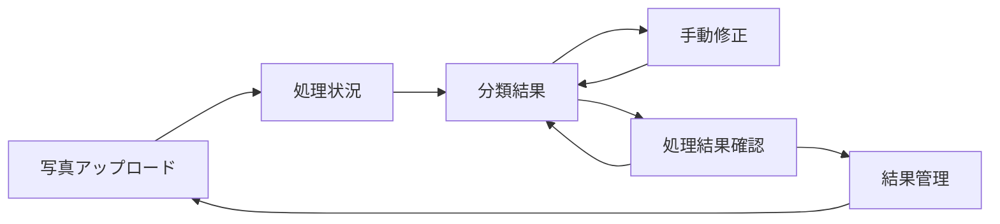

# 外部設計書

| 項目 | 内容 |
| --- | --- |
| プロジェクト名 | AI物件写真分類サービス |
| 作成日 | 2026/09/15 |
| 版数 | v0.1 |
| 関連資料 | [企画書](../01_proposal/proposal.md)、[要件定義書](../02_requirements/requirements.md) |

## 1. 目的

要件定義書に基づき、利用者から見える画面、画面遷移、入力・出力、分類結果の表示、およびプロトタイプで利用する外部インターフェースを定義する。

プロトタイプの完了条件は、写真のアップロード、YOLOによる検出、JavaScriptによる分類、カテゴリ別表示、手動修正までの一連の動作を確認できることである。課金、認証、外部API連携はプロトタイプの対象外とする。

## 2. プロトタイプの前提

- プロトタイプは自社検証環境で利用し、ログイン・課金・権限管理は実装しない。
- 画像分類は、YOLOの検出結果と信頼度をJavaScriptのルール処理へ渡して行う。
- 正式な信頼度閾値は未確定とし、プロトタイプでは設定値を変更可能な構成にする。
- 対応ブラウザは自社検証で使用する最新のChromeまたはEdgeを優先する。
- 分類結果は画面で確認し、将来の自社サービス連携に利用できるデータとして管理する。

## 3. 画面一覧

| 画面ID | 画面名 | 概要 | 関連機能ID |
| --- | --- | --- | --- |
| SC-01 | 写真アップロード画面 | 物件識別子を入力し、複数写真を選択して処理を開始する | F-001, F-002 |
| SC-02 | 処理状況画面 | 写真ごとの処理状態、処理済み枚数、失敗枚数を表示する | F-003, F-010 |
| SC-03 | 分類結果画面 | 7カテゴリと未分類の写真を一覧表示する | F-004, F-005, F-006, F-008 |
| SC-04 | 手動修正画面 | 写真の分類先を変更し、結果を保存する | F-007 |
| SC-05 | 結果管理画面 | 分類結果を確認し、処理結果を破棄する | F-009 |
| SC-06 | 処理結果確認画面 | 処理済み枚数、分類済み枚数、未分類枚数を確認する | F-008 |

## 4. 画面遷移



## 5. 画面仕様

### 5.1 共通表示

- 画面は日本語で表示する。
- 写真はサムネイルとファイル名を表示する。
- カテゴリ名と写真枚数を表示する。
- 未分類や処理失敗はテキストで表示する。

### 5.2 SC-01 写真アップロード画面

| 項目 | 仕様 |
| --- | --- |
| 目的 | 分類対象の写真を受け付け、処理を開始する |
| 入力 | 物件識別子、JPG・PNG写真の複数選択 |
| 表示 | 選択済み枚数、ファイル名、入力エラー |
| 操作 | ファイル選択、処理開始 |
| バリデーション | 拡張子、画像として読み込み可能か、設定上限枚数 |
| 成功時 | SC-02へ遷移し、処理を開始する |
| 失敗時 | 不正な写真を除外し、理由を一覧表示する |

### 5.3 SC-02 処理状況画面

| 項目 | 仕様 |
| --- | --- |
| 目的 | YOLO検出とJavaScript分類の進捗を確認する |
| 表示 | 全体枚数、処理済み枚数、失敗枚数 |
| 状態 | 未処理、処理中、完了、失敗 |
| 操作 | 分類結果を開く、失敗写真を確認する |
| 遷移条件 | 全件完了または一部失敗で分類結果画面へ進める |
| エラー | 1枚の処理失敗で全体を停止せず、該当写真を失敗として表示する |

### 5.4 SC-03 分類結果画面

| 項目 | 仕様 |
| --- | --- |
| 目的 | 顧客が確認したいカテゴリごとに写真を閲覧する |
| 表示 | カテゴリ一覧、写真サムネイル、写真枚数、分類結果 |
| カテゴリ | 浴室、トイレ、リビング、玄関、キッチン、洗面所、バルコニー、未分類 |
| 操作 | カテゴリ切替、手動修正画面へ移動、結果管理画面へ移動 |
| 表示順 | カテゴリ別に表示する |

### 5.5 SC-04 手動修正画面

| 項目 | 仕様 |
| --- | --- |
| 目的 | 自動分類の誤りを利用者が修正する |
| 表示 | 対象写真、現在のカテゴリ、分類先選択欄 |
| 入力 | 8分類のいずれかの分類先 |
| 操作 | 分類先変更、保存、キャンセル |
| 保存時 | `corrected` をtrueにし、変更後カテゴリを分類結果へ反映する |
| ルール | 手動修正後はAIの自動判定結果より利用者の修正結果を優先する |

### 5.6 SC-05 結果管理画面

| 項目 | 仕様 |
| --- | --- |
| 目的 | 処理結果の確認と破棄を行う |
| 表示 | 物件識別子、写真枚数、カテゴリ別枚数 |
| 操作 | 分類結果画面へ戻る、処理結果を破棄する |
| 破棄確認 | 破棄前に確認ダイアログを表示する |
| 破棄後 | 写真、検出結果、分類結果を削除し、アップロード画面へ戻る |

### 5.7 SC-06 処理結果確認画面

| 項目 | 仕様 |
| --- | --- |
| 目的 | 処理済み枚数、分類済み枚数、未分類枚数を確認する |
| 表示 | 処理済み枚数、分類済み枚数、未分類枚数、カテゴリ別内訳 |
| 操作 | 分類結果画面へ戻る、処理結果を破棄する |
| 遷移 | SC-03から遷移し、確認後にSC-03またはSC-05へ進む |
| 備考 | 画面ではカテゴリごとの件数を一覧し、処理結果の全体像を把握できるようにする |

## 6. 分類カテゴリ

| カテゴリ | 主な検出物 |
| --- | --- | --- |
| 浴室 | バスタブ、シャワー、浴室内設備 |
| トイレ | 便器、手洗い器、トイレ収納 |
| リビング | ソファ、テーブル、テレビ、窓 |
| 玄関 | 玄関扉、下足入れ、廊下 |
| キッチン | シンク、コンロ、冷蔵庫、キッチン収納 |
| 洗面所 | 洗面台、洗濯機置場、脱衣所 |
| バルコニー | 手すり、物干し竿、屋外床、眺望 |
| 未分類 | 判定根拠なし、信頼度不足、候補同率 |

## 7. 分類結果の外部データ形式

画面表示および将来の自社サービス連携を想定し、分類結果は次のJSON相当の項目で扱う。

```json
{
  "propertyId": "property-001",
  "photoId": "photo-001",
  "fileName": "IMG_0001.jpg",
  "category": "kitchen",
  "categoryLabel": "キッチン",
  "confidence": 0.82,
  "detectedObjects": [
    {
      "name": "sink",
      "confidence": 0.91,
      "box": { "x": 120, "y": 80, "width": 260, "height": 180 }
    }
  ],
  "corrected": false,
  "status": "completed"
}
```

`confidence` は0以上1以下の数値とし、未分類の場合も検出結果があれば保持する。手動修正時は`category`を変更し、`corrected`を`true`にする。

| 表示名 | コード |
| --- | --- |
| 浴室 | bathroom |
| トイレ | toilet |
| リビング | living |
| 玄関 | entrance |
| キッチン | kitchen |
| 洗面所 | washroom |
| バルコニー | balcony |
| 未分類 | unclassified |

## 8. 外部インターフェース概要

プロトタイプでは外部事業者向けの公開APIを提供しない。画面と分類処理の境界を、将来のAPI化を妨げない形式で定義する。

| IF ID | 方式 | 入力 | 出力 | 用途 |
| --- | --- | --- | --- | --- |
| IF-001 | 画面入力 | 物件識別子、写真ファイル | アップロード受付結果 | 写真を分類処理へ渡す |
| IF-002 | 内部処理境界 | 画像データ | 検出物名、矩形、信頼度 | YOLO検出結果を分類処理へ渡す |
| IF-003 | 内部処理境界 | 検出結果、分類ルール | カテゴリ、信頼度、根拠物体 | JavaScript分類結果を画面へ渡す |
| IF-004 | 画面操作 | 写真ID、変更後カテゴリ | 更新後分類結果 | 手動修正結果を保存する |
| IF-005 | 画面操作 | 処理単位ID | 削除結果 | 処理結果を破棄する |

### 9.1 将来API化する場合の候補

| API ID | メソッド | パス候補 | 概要 | 状態 |
| --- | --- | --- | --- | --- |
| API-001 | POST | /api/classifications | 写真を受け付け、分類処理を開始する | 将来検討 |
| API-002 | GET | /api/classifications/{id} | 処理状況と分類結果を取得する | 将来検討 |
| API-003 | PATCH | /api/photos/{id}/category | 写真カテゴリを手動修正する | 将来検討 |
| API-004 | DELETE | /api/classifications/{id} | 処理結果を破棄する | 将来検討 |

## 9. 入出力チェック

| 項目 | ルール |
| --- | --- |
| ファイル形式 | JPG、PNGのみ受け付ける |
| ファイル内容 | 拡張子だけでなく画像として読み込めることを確認する |
| 写真枚数 | プロトタイプ設定の上限を超えた場合は処理を開始しない |
| 物件識別子 | 必須。空文字と制御文字を受け付けない |
| カテゴリ | 定義済み8分類のコードのみ受け付ける |
| 信頼度 | 0以上1以下の数値として扱う |
| ファイル名表示 | HTMLエスケープして表示する |
| エラー情報 | 内部スタックトレースを表示せず、利用者向けメッセージを返す |

## 10. アクセシビリティ

- 主要操作はキーボードで操作できるようにする。
- エラーや未分類は色だけで表現せず、テキストでも表示する。

## 11. プロトタイプ検証シナリオ

1. JPG・PNGの写真を複数枚選択する。
2. 物件識別子を入力して処理を開始する。
3. 処理状況が表示され、処理完了後に分類結果画面へ移動できる。
4. 7カテゴリと未分類に写真が表示される。
5. 処理結果確認画面で処理済み枚数、分類済み枚数、未分類枚数を確認できる。
6. 誤分類写真を別カテゴリへ手動修正できる。
7. 画面を再表示しても修正後の分類結果を確認できる。
8. 不要な処理結果を破棄できる。

## 12. 1.5日プロトタイプの工程

| フェーズ | 期間 | 外部設計上の完了条件 |
| --- | --- | --- |
| 企画確定 | 0.5日 | カテゴリ、評価用写真、分類ルールを確定する |
| プロトタイプ開発 | 0.5日 | アップロード、YOLO検出、JavaScript分類、カテゴリ表示、手動修正が動作する |
| 確認・検証 | 0.5日 | 分類結果の表示、手動修正、基本動作の確認が完了する |

## 13. 未確定事項

- YOLOモデルの具体的な種類と実行場所
- プロトタイプで利用するファイルサイズ上限
- 暫定の信頼度閾値とカテゴリ別の調整方法
- 分類結果を保存する具体的な方式
- 将来API化する際の認証・認可方式

## 14. 変更履歴

| 版数 | 日付 | 変更内容 | 作成者 |
| --- | --- | --- | --- |
| v0.1 | 2026/09/15 | AI物件写真分類サービスのプロトタイプ外部設計書を作成 | 渡邉極 |