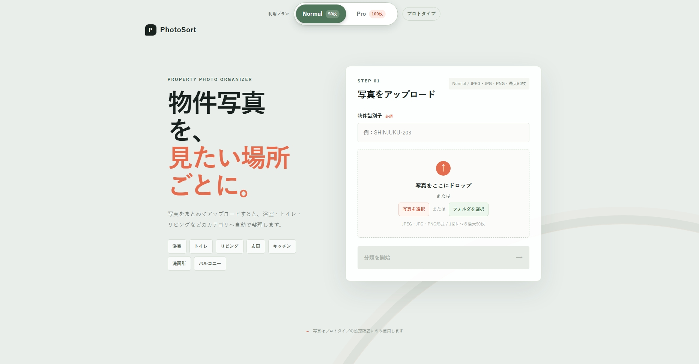

# プロトタイプ画面記録

| 項目 | 内容 |
| --- | --- |
| プロジェクト名 | AI物件写真分類サービス（PhotoSort） |
| 記録日 | 2026/09/17 |
| 対象 | Normal / Proプランの開発途中プロトタイプ |
| 状態 | 開発途中・画面確認用 |

## 1. 画面スクリーンショット

> 本画像は開発途中のプロトタイプ画面であり、正式リリース版のデザイン・仕様を確定するものではない。

## 2. 画面で確認できる内容

- サービス名として「PhotoSort」を表示している。
- 利用プランの切り替えとしてNormal、Pro、プロトタイプを表示している。
- Normal選択時の1回あたりのアップロード上限を50枚として表示している。
- Proの1回あたりのアップロード上限を100枚として表示している。
- 物件識別子を入力できる。
- 写真またはフォルダを選択してアップロードできる。
- 対応形式としてJPEG、JPG、PNGを表示している。
- 画面左側に分類対象カテゴリとして浴室、トイレ、リビング、玄関、キッチン、洗面所、バルコニーを表示している。

## 3. 既存資料との対応

| 画面上の要素 | 対応する既存資料 |
| --- | --- |
| 物件識別子の入力 | [要件定義書 F-001](../02_requirements/requirements.md)、[外部設計書 SC-01](../04_external-design/external-design.md) |
| 写真・フォルダの選択 | [要件定義書 F-001](../02_requirements/requirements.md) |
| JPEG・JPG・PNGの対応 | [要件定義書 F-001](../02_requirements/requirements.md)、[外部設計書 9. 入出力チェック](../04_external-design/external-design.md) |
| Normal 50枚 / Pro 100枚 | [要件定義書 7. プラン別利用制限](../02_requirements/requirements.md) |
| 7カテゴリの表示 | [要件定義書 6.1 分類カテゴリ](../02_requirements/requirements.md)、[外部設計書 6. 分類カテゴリ](../04_external-design/external-design.md) |

## 4. 仕様上の扱い

- Normalの50枚、Proの100枚は、本番サービスで想定する「1回のアップロード」上限と一致する。
- 本プロトタイプでは、料金計算、契約管理、ログイン、権限管理、プラン変更処理は実装対象外とする。
- 画面上のプラン切り替えは、プラン別の画面表示および上限確認を行うためのプロトタイプ要素として扱う。
- 上限値は画面に表示するだけでなく、アップロード開始時の入力チェックにも適用する。
- スクリーンショットに表示されている分類カテゴリは、既存資料で定義した7カテゴリと一致している。

## 5. 確認事項

- Proの画面で「1回のアップロード 100枚」と表示されることを確認する。
- Normal・Proそれぞれで上限枚数を超えた場合、処理を開始せずエラーを表示する。
- 「プロトタイプ」表示は開発途中であることを示すラベルとして扱い、正式版では表示要否を決定する。
- プラン切り替えの状態保持、料金表示、契約状態との連動は、課金・契約仕様確定後に別途定義する。
